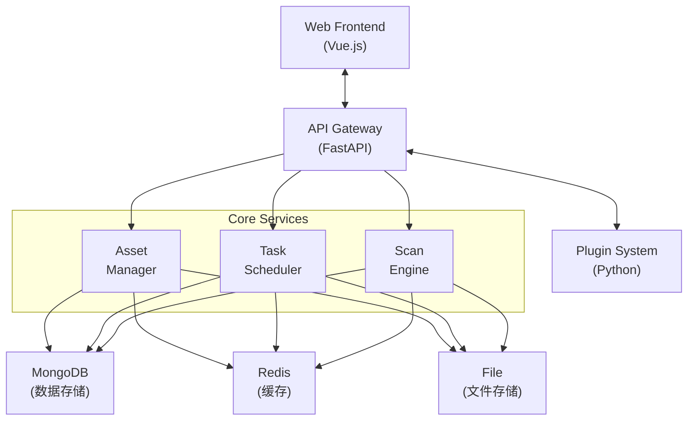

# ScopeSentry - 高效资产信息收集与漏洞扫描平台

[](https://python.org)
[](https://fastapi.tiangolo.com)
[](https://mongodb.com)
[](LICENSE)

ScopeSentry 是一个功能强大的资产信息收集与漏洞扫描平台，旨在为安全研究人员和企业提供全面的资产发现和安全评估能力。

## 🚀 项目介绍

ScopeSentry 是一个基于 FastAPI 的现代化安全扫描平台，集成了多种开源安全工具，为用户提供一站式的资产发现、漏洞扫描和安全评估服务。平台支持分布式部署、插件扩展和实时监控，是企业级安全运营的理想选择。

### ✨ 主要特性

- **🔍 全面资产发现**: 子域名发现、端口扫描、资产测绘
- **🛡️ 多维度安全检测**: Web指纹识别、漏洞扫描、敏感信息检测
- **🔌 插件化架构**: 支持自定义插件扩展
- **📊 实时监控**: 页面监控、任务调度、结果统计
- **🌐 分布式扫描**: 支持多节点分布式部署
- **📈 可视化界面**: 现代化Web界面，数据可视化展示
- **🔐 安全防护**: JWT认证、Redis缓存、数据加密

### 🎯 核心功能模块

- **资产发现**: 子域名枚举、端口存活检测、服务识别
- **Web安全**: 指纹识别、目录扫描、敏感信息泄露检测
- **漏洞扫描**: 基于nuclei的高效漏洞检测
- **URL分析**: 爬虫收集、链接发现、页面监控
- **数据管理**: 项目管理、任务调度、结果导出

## 🏗️ 系统架构

### 总体架构图



### 模块架构

#### 1. API服务层
- **用户管理**: 认证授权、权限控制
- **项目管理**: 项目创建、配置管理
- **任务调度**: 扫描任务创建、执行、监控
- **资产管理**: 资产信息存储、查询、统计
- **结果导出**: 多格式导出、报告生成

#### 2. 核心服务层
- **扫描引擎**: 任务分发、结果收集
- **插件管理**: 插件加载、配置管理
- **数据处理**: 结果解析、数据清洗
- **监控服务**: 系统监控、性能统计

#### 3. 数据存储层
- **MongoDB**: 主要数据存储
- **Redis**: 缓存和消息队列
- **文件系统**: 文件上传、日志存储

#### 4. 插件系统
支持的插件类型：
- **SubdomainScan**: 子域名扫描 (OneForAll, Subfinder)
- **PortScan**: 端口扫描 (RustScan, Nmap)
- **AssetMapping**: 资产测绘 (httpx)
- **URLScan**: URL发现 (katana)
- **VulnerabilityScan**: 漏洞扫描 (nuclei)
- **DirScan**: 目录扫描 (SentryDir)
- **WebCrawler**: 网页爬虫 (rad)

## 🛠️ 技术栈

### 后端技术
- **Python 3.11+**: 主要开发语言
- **FastAPI**: 现代化异步Web框架
- **MongoDB**: 主数据库
- **Redis**: 缓存和消息队列
- **APScheduler**: 任务调度
- **loguru**: 日志管理

### 前端技术
- **Vue.js**: 前端框架
- **现代化UI组件**: 用户界面

### 部署技术
- **Docker**: 容器化部署
- **Nginx**: 反向代理和静态文件服务

## 📦 安装部署

### 环境要求
- Python 3.11+
- MongoDB 6.0+
- Redis 5.0+
- Docker (可选)

### 快速开始

1. **克隆项目**
```bash
git clone https://github.com/Autumn-27/ScopeSentry.git
cd ScopeSentry
```

2. **安装依赖**
```bash
pip install -r requirements.txt
```

3. **配置文件**
```yaml
# config.yaml
mongodb:
  ip: 127.0.0.1
  port: 27017
  mongodb_database: ScopeSentry
  username: root
  password: your_password

redis:
  ip: 127.0.0.1
  port: 6379
  password: your_password

system:
  timezone: Asia/Shanghai
```

4. **启动服务**
```bash
python main.py
```

### Docker 部署

```bash
# 构建镜像
docker build -t scopesentry .

# 运行容器
docker run -d -p 8000:8000 \
  -e MONGODB_IP=your_mongodb_ip \
  -e REDIS_IP=your_redis_ip \
  scopesentry
```

## 📝 使用说明

1. **访问Web界面**: `http://localhost:8000`
2. **默认账户**: 
   - 用户名: `ScopeSentry`
   - 密码: 查看 `PASSWORD` 文件
3. **插件密钥**: 查看 `PLUGINKEY` 文件

## 🔧 配置说明

### 基础配置
- **数据库连接**: MongoDB和Redis连接配置
- **时区设置**: 支持全球时区配置
- **日志配置**: 日志级别和存储配置

### 扫描配置
- **扫描模板**: 预定义扫描流程
- **插件参数**: 各插件的详细参数配置
- **并发控制**: 扫描任务并发数限制

## 📊 功能特性

### 资产发现
- 子域名枚举扫描
- 端口存活检测
- 服务指纹识别
- Web资产测绘

### 安全检测
- 漏洞扫描检测
- 敏感信息泄露检测
- 目录结构扫描
- Web指纹识别

### 数据管理
- 项目分组管理
- 扫描结果统计
- 数据导出功能
- 历史记录查询

## 📈 TODO List

### 🚀 高优先级
- [v] **上传优化功能**
  - [v] 批量文件上传支持
- [ ] **性能优化**
  - [ ] 数据库查询优化
  - [ ] 异步任务处理优化
  - [ ] 内存使用优化
- [ ] **API接口增强**
  - [ ] RESTful API完善
  - [ ] API文档自动生成

### 🔧 中优先级
- [ ] **监控告警**
  - [ ] 实时监控面板
  - [ ] 自定义告警规则
  - [ ] 邮件/钉钉通知
- [ ] **报告系统**
  - [ ] 自动化报告生成
  - [ ] 多格式报告导出
  - [ ] 报告模板定制
- [ ] **插件生态**
  - [ ] 插件商店功能
  - [ ] 插件开发SDK
  - [ ] 第三方插件支持

### 🎨 低优先级
- [ ] **界面优化**
  - [ ] 移动端适配
  - [ ] 暗色主题支持
  - [ ] 用户体验提升
- [ ] **多租户支持**
  - [ ] 组织架构管理
  - [ ] 权限细分控制
  - [ ] 资源隔离机制

## 🤝 贡献指南

欢迎贡献代码、报告问题或提出建议！

1. Fork 本仓库
2. 创建功能分支
3. 提交代码更改
4. 推送到分支
5. 创建 Pull Request

## 📄 许可证

本项目采用 MIT 许可证 - 详见 [LICENSE](LICENSE) 文件

## 🔗 相关链接

- [官方网站](https://www.scope-sentry.top)
- [更新日志](https://www.scope-sentry.top/guide/update/)
- [使用文档](https://www.scope-sentry.top/guide/)
- [问题反馈](https://github.com/Autumn-27/ScopeSentry/issues)

## 👥 联系方式

- 作者: Autumn
- 邮箱: rainy-autumn@outlook.com
- GitHub: [@Autumn-27](https://github.com/Autumn-27)

---

⭐ 如果这个项目对您有帮助，请给个星标！ 